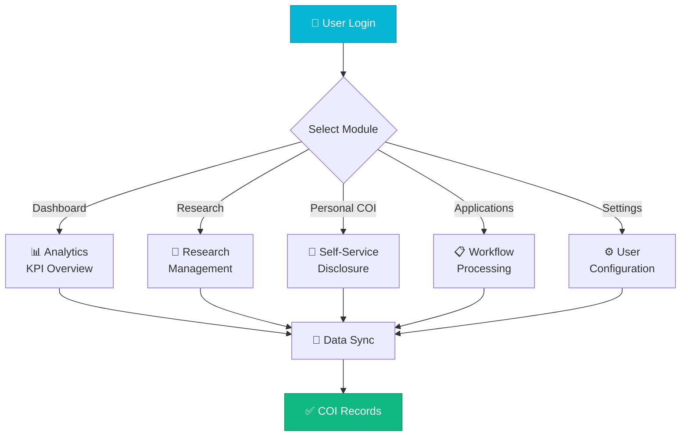

[English](README.md) | [中文](README_CN.md)

<div align="center">

```svg
<svg viewBox="0 0 800 120" xmlns="http://www.w3.org/2000/svg">
  <defs>
    <style>
      @import url('https://fonts.googleapis.com/css2?family=Poppins:wght@700&display=swap');
      .coiweb-title {
        font-family: 'Poppins', sans-serif;
        font-size: 64px;
        font-weight: 700;
        fill: url(#coiwebGradient);
        letter-spacing: -1px;
      }
      .coiweb-subtitle {
        font-family: 'Poppins', sans-serif;
        font-size: 16px;
        fill: #64748b;
        letter-spacing: 1px;
      }
    </style>
    <linearGradient id="coiwebGradient" x1="0%" y1="0%" x2="100%" y2="100%">
      <stop offset="0%" style="stop-color:#06b6d4;stop-opacity:1" />
      <stop offset="100%" style="stop-color:#0891b2;stop-opacity:1" />
    </linearGradient>
  </defs>
  <text x="400" y="75" text-anchor="middle" class="coiweb-title">COI Web</text>
  <text x="400" y="105" text-anchor="middle" class="coiweb-subtitle">Conflict of Interest Management Application</text>
</svg>
```

**Complete COI Management Web Application** 🌐

[](https://react.dev)
[](https://vitejs.dev)
[](https://reactrouter.com)
[](https://lucide.dev)
[](https://github.com/features/actions)
[](LICENSE)

[📖 View Docs](#-project-structure) · [🐛 Report Bug](https://github.com/hakupao/coi-web-demo/issues) · [💡 Request Feature](https://github.com/hakupao/coi-web-demo/discussions)

</div>

---

## 📋 Table of Contents

- [Overview](#overview)
- [Features](#features)
- [Pages](#pages)
- [Tech Stack](#tech-stack)
- [Getting Started](#getting-started)
- [Project Structure](#project-structure)
- [Development](#development)
- [Deployment](#deployment)
- [Contributing](#contributing)
- [License](#license)

---

## 🎯 Overview

<details open>
<summary><strong>COI Web</strong> is a comprehensive web application for managing Conflict of Interest disclosures and affiliations.</summary>

This application provides a complete ecosystem for:
- **Dashboard Analytics** — Overview of all COI records and metrics
- **Research Management** — Track and manage research activities and affiliations
- **Personal COI Management** — Self-service COI disclosure and tracking
- **Application Processing** — Workflow management for COI applications
- **Settings & Configuration** — User preferences and system administration

Built with modern React and Vite for optimal performance and developer experience.

</details>

### Application Flow



---

## ✨ Features

| Feature | Description |
|---------|-------------|
| 📊 **Dashboard** | Comprehensive overview of COI metrics and records |
| 🔬 **Research Module** | Manage research projects and academic affiliations |
| 📝 **Personal COI** | Self-service disclosure form and history tracking |
| 📋 **Applications** | Application workflow and approval processes |
| ⚙️ **Settings** | User preferences, profile management, access control |
| 🎨 **Modern UI** | Clean, intuitive interface with Lucide icons |
| 📱 **Responsive** | Works seamlessly across all devices |
| 🚀 **Fast Performance** | Built with Vite for lightning-fast load times |
| ⌨️ **Navigation** | Smooth routing with React Router v6 |
| 📊 **Data Visualization** | Charts and graphs for analytics |

---

## 📄 Pages

<details>
<summary><strong>Application Pages Overview</strong></summary>

### Dashboard
- Real-time KPI metrics
- COI record statistics
- Recent activity feed
- Quick action buttons

### Research
- Research project listing
- Affiliation management
- Funding source tracking
- Collaboration records

### Personal COI
- Self-disclosure form
- COI history
- Document upload
- Status tracking

### Applications
- Application queue
- Review workflow
- Approval tracking
- Status filters

### Settings
- User profile management
- Password and authentication
- Notification preferences
- Access control settings

</details>

---

## 🛠️ Tech Stack

<details open>
<summary><strong>View Technology Details</strong></summary>

| Technology | Purpose |
|-----------|---------|
| **React** | UI library and component framework |
| **Vite** | Next-generation build tool and dev server |
| **React Router** | Client-side routing and navigation |
| **Lucide React** | Beautiful, consistent icon library |
| **JavaScript** | Core application logic |
| **CSS/SCSS** | Styling and responsive design |
| **GitHub Actions** | CI/CD automation |

**Deployment**: GitHub Pages / Custom Server

**Development Tools**: Node.js, npm/yarn/pnpm

</details>

---

## 📁 Project Structure

```
coi-web-demo/
├── src/
│   ├── components/
│   │   ├── Dashboard/           # Dashboard components
│   │   ├── Research/            # Research management components
│   │   ├── PersonalCoi/         # Personal COI components
│   │   ├── Applications/        # Application workflow components
│   │   ├── Settings/            # Settings components
│   │   ├── Navigation/          # Header and navigation
│   │   └── common/              # Reusable utility components
│   ├── pages/
│   │   ├── Dashboard.jsx        # Dashboard page
│   │   ├── Research.jsx         # Research page
│   │   ├── PersonalCoi.jsx      # Personal COI page
│   │   ├── Applications.jsx     # Applications page
│   │   ├── Settings.jsx         # Settings page
│   │   └── NotFound.jsx         # 404 page
│   ├── hooks/                   # Custom React hooks
│   ├── utils/                   # Utility functions
│   ├── styles/                  # Global styles
│   ├── App.jsx                  # Main app component
│   └── main.jsx                 # Entry point
├── public/                      # Static assets and images
├── docs/
│   └── images/                  # Documentation images
├── index.html                   # HTML template
├── vite.config.js               # Vite configuration
├── .github/workflows/           # GitHub Actions CI/CD
├── package.json                 # Project dependencies
└── README.md                    # This file
```

---

## 🚀 Getting Started

### Prerequisites
- **Node.js** 14.0 or higher
- **npm**, **yarn**, or **pnpm** package manager

### Installation

```bash
# Clone the repository
git clone https://github.com/hakupao/coi-web-demo.git
cd coi-web-demo

# Install dependencies
npm install
# or
pnpm install

# Start development server
npm run dev
# → Visit http://localhost:5173
```

### Available Scripts

```bash
# Development server with hot reload
npm run dev

# Build for production
npm run build

# Preview production build
npm run preview

# Type checking (if applicable)
npm run type-check

# Lint code
npm run lint
```

---

## 💻 Development

### Component Structure

Components are organized by feature module:

```jsx
// Example: Dashboard Component
import React from 'react';
import { BarChart, Users, FileText } from 'lucide-react';

export function Dashboard() {
  return (
    <div className="dashboard-container">
      <h1>COI Dashboard</h1>

      <div className="kpi-cards">
        <Card icon={Users} title="Total Records" value="234" />
        <Card icon={FileText} title="Pending Review" value="12" />
        <Card icon={BarChart} title="This Month" value="18" />
      </div>

      <div className="content">
        {/* Page content */}
      </div>
    </div>
  );
}
```

### Routing Configuration

React Router v6 provides seamless navigation:

```jsx
// App.jsx routing setup
import { BrowserRouter, Routes, Route } from 'react-router-dom';
import Dashboard from './pages/Dashboard';
import Research from './pages/Research';
import PersonalCoi from './pages/PersonalCoi';
import Applications from './pages/Applications';
import Settings from './pages/Settings';

function App() {
  return (
    <BrowserRouter>
      <Routes>
        <Route path="/" element={<Dashboard />} />
        <Route path="/research" element={<Research />} />
        <Route path="/personal-coi" element={<PersonalCoi />} />
        <Route path="/applications" element={<Applications />} />
        <Route path="/settings" element={<Settings />} />
        <Route path="*" element={<NotFound />} />
      </Routes>
    </BrowserRouter>
  );
}
```

### Using Lucide Icons

```jsx
import { AlertCircle, CheckCircle, Clock, Users } from 'lucide-react';

export function StatusBadge({ status }) {
  const icons = {
    active: <CheckCircle className="icon-success" />,
    pending: <Clock className="icon-warning" />,
    alert: <AlertCircle className="icon-danger" />
  };

  return <span>{icons[status]}</span>;
}
```

---

## 🌐 Deployment

### GitHub Pages

```bash
# GitHub Actions automatically deploys on push to main
# Configure vite.config.js for your base path:

export default {
  base: '/coi-web-demo/',
  // ... other config
}
```

### Custom Server

```bash
# Build production bundle
npm run build

# Deploy dist/ folder to your server
```

**GitHub Actions CI/CD:**
- Automatic testing and linting
- Production build generation
- Automatic deployment on main branch push

---

## 📊 Data Management

The application handles COI data with the following structure:

```javascript
// Sample COI Record
{
  id: "COI-2024-001",
  userId: "user-123",
  type: "financial",
  status: "active",
  affiliations: [
    {
      id: "aff-1",
      organization: "Organization A",
      role: "Board Member",
      percentageOwnership: 5,
      startDate: "2023-01-01"
    }
  ],
  disclosureDate: "2024-01-15",
  lastUpdated: "2024-03-20",
  reviewer: "admin-001"
}
```

---

## 🤝 Contributing

Contributions are welcome! Please follow these steps:

1. **Fork** the repository
2. **Create** a feature branch: `git checkout -b feature/your-feature`
3. **Make** your changes with clear commits
4. **Push** to your fork
5. **Open** a Pull Request

**Guidelines:**
- Follow existing code style
- Use descriptive commit messages
- Test your changes before submitting
- Update documentation as needed

---

## 📄 License

This project is licensed under the **MIT License** — see the [LICENSE](LICENSE) file for details.

---

<div align="center">

### 🎯 Built by [hakupao](https://github.com/hakupao)

[⬆ back to top](#-table-of-contents)

**Need help?** [Open an issue](https://github.com/hakupao/coi-web-demo/issues) on GitHub.

</div>
