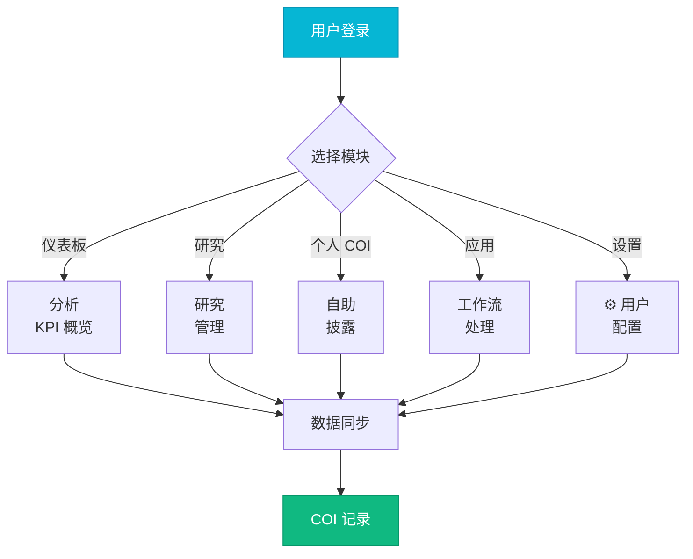
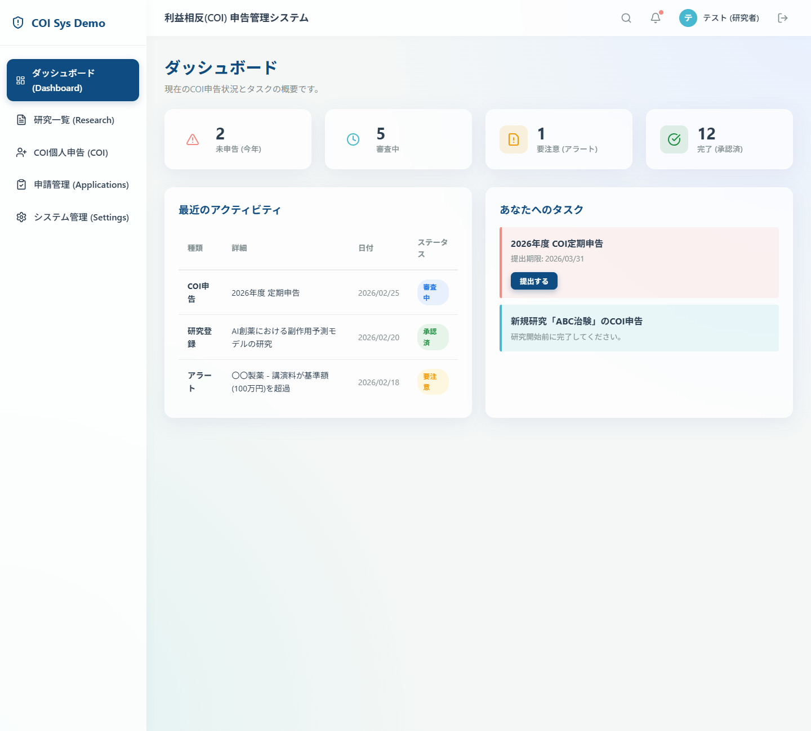
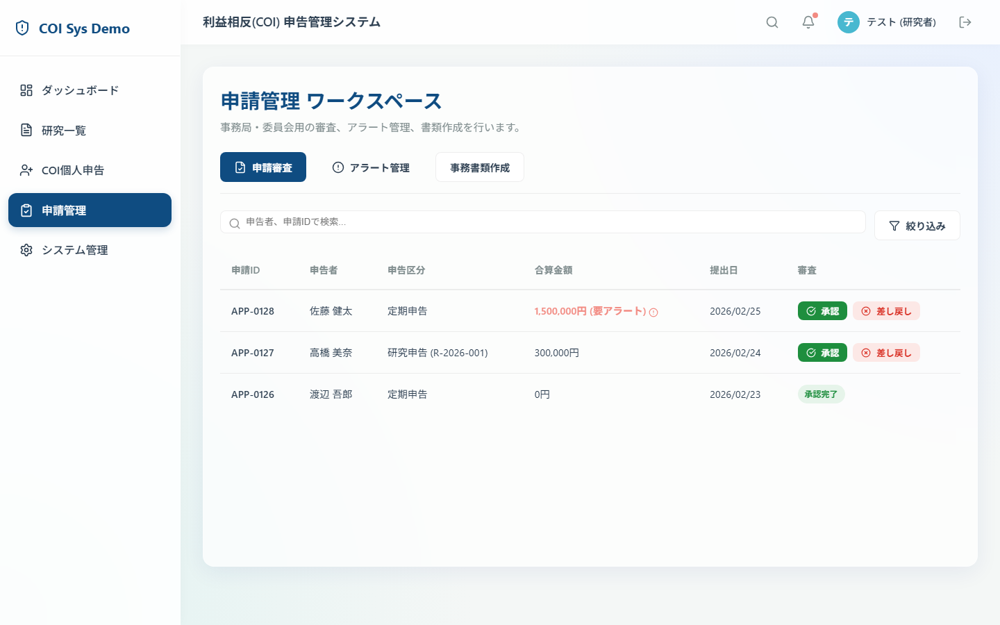
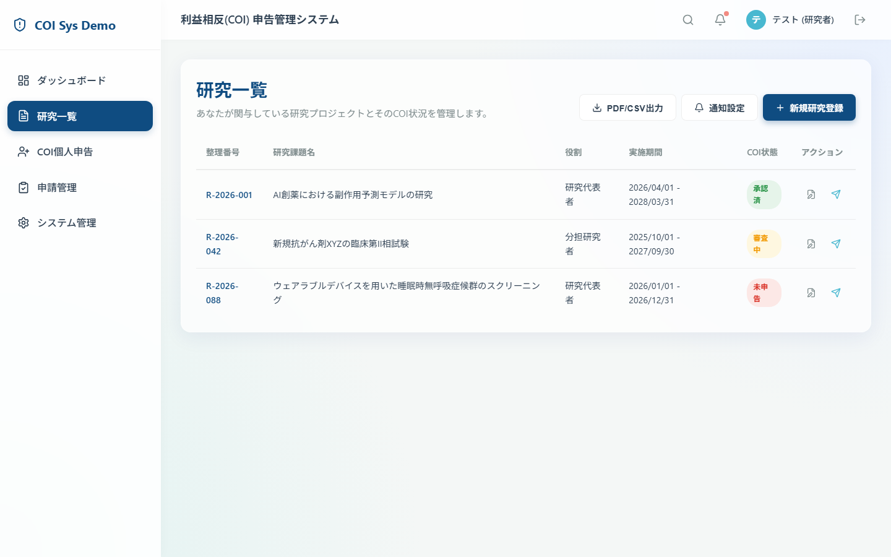

[English](README.md) | [中文](README_CN.md)

<div align="center">


**完整的利益冲突管理 Web 应用** 🌐

[](https://react.dev)
[](https://vitejs.dev)
[](https://reactrouter.com)
[](https://lucide.dev)
[](https://github.com/features/actions)
[](LICENSE)

[📖 查看文档](#-项目结构) · [🐛 报告问题](https://github.com/hakupao/coi-web-demo/issues) · [💡 建议功能](https://github.com/hakupao/coi-web-demo/discussions)

</div>

---

## 📋 目录

- [项目概览](#项目概览)
- [核心特性](#核心特性)
- [应用页面](#应用页面)
- [技术栈](#技术栈)
- [快速开始](#快速开始)
- [项目结构](#项目结构)
- [开发指南](#开发指南)
- [部署说明](#部署说明)
- [贡献指南](#贡献指南)
- [开源协议](#开源协议)

---

## 🎯 项目概览

<details open>
<summary><strong>COI Web</strong> 是一个用于管理利益冲突披露和关联关系的综合 Web 应用。</summary>

该应用提供完整的 COI 管理生态系统，包括：
- **仪表板分析** — 所有 COI 记录和指标的概览
- **研究管理** — 跟踪和管理研究活动与关联关系
- **个人 COI 管理** — 自助式 COI 披露和跟踪
- **应用处理** — COI 应用的工作流管理
- **设置与配置** — 用户偏好和系统管理

采用现代 React 和 Vite 构建，以获得最优的性能和开发体验。

</details>

### 应用流程



---

## ✨ 核心特性

| 特性 | 描述 |
|------|------|
| 📊 **仪表板** | COI 指标和记录的综合概览 |
| 🔬 **研究模块** | 管理研究项目和学术关联 |
| 📝 **个人 COI** | 自助披露表单和历史跟踪 |
| 📋 **应用处理** | 应用工作流和批准流程 |
| ⚙️ **设置** | 用户偏好、配置和访问控制 |
| 🎨 **现代 UI** | 简洁直观的界面和 Lucide 图标 |
| 📱 **响应式** | 在所有设备上无缝工作 |
| 🚀 **高性能** | 使用 Vite 构建以实现闪电般的加载速度 |
| ⌨️ **导航** | 使用 React Router v6 的平滑路由 |
| 📊 **数据可视化** | 分析图表和图形 |

---

## 📄

### 界面截图

| 仪表板 | 申请管理 | 研究一览 |
|:------:|:-------:|:-------:|
|  |  |  |

 应用页面

<details>
<summary><strong>应用页面概览</strong></summary>

### 仪表板
- 实时 KPI 指标
- COI 记录统计
- 最近活动提要
- 快速操作按钮

### 研究
- 研究项目列表
- 关联管理
- 资金来源追踪
- 协作记录

### 个人 COI
- 自助披露表单
- COI 历史
- 文件上传
- 状态跟踪

### 应用
- 应用队列
- 审查工作流
- 批准跟踪
- 状态过滤

### 设置
- 用户档案管理
- 密码和身份验证
- 通知偏好
- 访问控制设置

</details>

---

## 🛠️ 技术栈

<details open>
<summary><strong>查看技术详情</strong></summary>

| 技术 | 用途 |
|------|------|
| **React** | UI 库和组件框架 |
| **Vite** | 下一代构建工具和开发服务器 |
| **React Router** | 客户端路由和导航 |
| **Lucide React** | 美观一致的图标库 |
| **JavaScript** | 核心应用逻辑 |
| **CSS/SCSS** | 样式和响应式设计 |
| **GitHub Actions** | CI/CD 自动化 |

**部署**: GitHub Pages / 自定义服务器

**开发工具**: Node.js, npm/yarn/pnpm

</details>

---

## 📁 项目结构

```
coi-web-demo/
├── src/
│   ├── components/
│   │   ├── Dashboard/           # 仪表板组件
│   │   ├── Research/            # 研究管理组件
│   │   ├── PersonalCoi/         # 个人 COI 组件
│   │   ├── Applications/        # 应用工作流组件
│   │   ├── Settings/            # 设置组件
│   │   ├── Navigation/          # 头部和导航
│   │   └── common/              # 可复用工具组件
│   ├── pages/
│   │   ├── Dashboard.jsx        # 仪表板页面
│   │   ├── Research.jsx         # 研究页面
│   │   ├── PersonalCoi.jsx      # 个人 COI 页面
│   │   ├── Applications.jsx     # 应用页面
│   │   ├── Settings.jsx         # 设置页面
│   │   └── NotFound.jsx         # 404 页面
│   ├── hooks/                   # 自定义 React Hooks
│   ├── utils/                   # 工具函数
│   ├── styles/                  # 全局样式
│   ├── App.jsx                  # 主应用组件
│   └── main.jsx                 # 入口文件
├── public/                      # 静态资源和图片
├── docs/
│   └── images/                  # 文档图片
├── index.html                   # HTML 模板
├── vite.config.js               # Vite 配置
├── .github/workflows/           # GitHub Actions CI/CD
├── package.json                 # 项目依赖
└── README.md                    # 本文件
```

---

## 🚀 快速开始

### 前置要求
- **Node.js** 14.0 或更高版本
- **npm**、**yarn** 或 **pnpm** 包管理器

### 安装步骤

```bash
# 克隆仓库
git clone https://github.com/hakupao/coi-web-demo.git
cd coi-web-demo

# 安装依赖
npm install
# 或
pnpm install

# 启动开发服务器
npm run dev
# → 访问 http://localhost:5173
```

### 可用命令

```bash
# 带热重载的开发服务器
npm run dev

# 生产环境构建
npm run build

# 预览生产构建
npm run preview

# 类型检查（如适用）
npm run type-check

# 代码检查
npm run lint
```

---

## 💻 开发指南

### 组件结构

组件按功能模块组织：

```jsx
// 示例：仪表板组件
import React from 'react';
import { BarChart, Users, FileText } from 'lucide-react';

export function Dashboard() {
  return (
    <div className="dashboard-container">
      <h1>COI 仪表板</h1>

      <div className="kpi-cards">
        <Card icon={Users} title="总记录数" value="234" />
        <Card icon={FileText} title="待审查" value="12" />
        <Card icon={BarChart} title="本月" value="18" />
      </div>

      <div className="content">
        {/* 页面内容 */}
      </div>
    </div>
  );
}
```

### 路由配置

React Router v6 提供无缝导航：

```jsx
// App.jsx 路由设置
import { BrowserRouter, Routes, Route } from 'react-router-dom';
import Dashboard from './pages/Dashboard';
import Research from './pages/Research';
import PersonalCoi from './pages/PersonalCoi';
import Applications from './pages/Applications';
import Settings from './pages/Settings';

function App() {
  return (
    <BrowserRouter>
      <Routes>
        <Route path="/" element={<Dashboard />} />
        <Route path="/research" element={<Research />} />
        <Route path="/personal-coi" element={<PersonalCoi />} />
        <Route path="/applications" element={<Applications />} />
        <Route path="/settings" element={<Settings />} />
        <Route path="*" element={<NotFound />} />
      </Routes>
    </BrowserRouter>
  );
}
```

### 使用 Lucide 图标

```jsx
import { AlertCircle, CheckCircle, Clock, Users } from 'lucide-react';

export function StatusBadge({ status }) {
  const icons = {
    active: <CheckCircle className="icon-success" />,
    pending: <Clock className="icon-warning" />,
    alert: <AlertCircle className="icon-danger" />
  };

  return <span>{icons[status]}</span>;
}
```

---

## 🌐 部署说明

### GitHub Pages

```bash
# GitHub Actions 在推送到 main 时自动部署
# 在 vite.config.js 中配置基础路径：

export default {
  base: '/coi-web-demo/',
  // ... 其他配置
}
```

### 自定义服务器

```bash
# 构建生产 bundle
npm run build

# 部署 dist/ 文件夹到你的服务器
```

**GitHub Actions CI/CD:**
- 自动化测试和代码检查
- 生产构建生成
- main 分支推送时自动部署

---

## 📊 数据管理

该应用处理具有以下结构的 COI 数据：

```javascript
// 示例 COI 记录
{
  id: "COI-2024-001",
  userId: "user-123",
  type: "financial",
  status: "active",
  affiliations: [
    {
      id: "aff-1",
      organization: "机构 A",
      role: "董事会成员",
      percentageOwnership: 5,
      startDate: "2023-01-01"
    }
  ],
  disclosureDate: "2024-01-15",
  lastUpdated: "2024-03-20",
  reviewer: "admin-001"
}
```

---

## 🤝 贡献指南

欢迎贡献！请遵循以下步骤：

1. **Fork** 仓库
2. **创建** 功能分支: `git checkout -b feature/your-feature`
3. **提交** 更改（清晰的 commit 信息）
4. **推送** 到你的 fork
5. **开启** Pull Request

**指南：**
- 遵循现有代码风格
- 使用描述性的 commit 信息
- 提交前测试你的更改
- 根据需要更新文档

---

## 📄 开源协议

本项目采用 **MIT 许可证** — 详见 [LICENSE](LICENSE) 文件。

---

<div align="center">

### 🎯 由 [hakupao](https://github.com/hakupao) 构建

[⬆ 返回顶部](#目录)

**需要帮助？** 在 GitHub 上 [提交 issue](https://github.com/hakupao/coi-web-demo/issues)。

</div>
